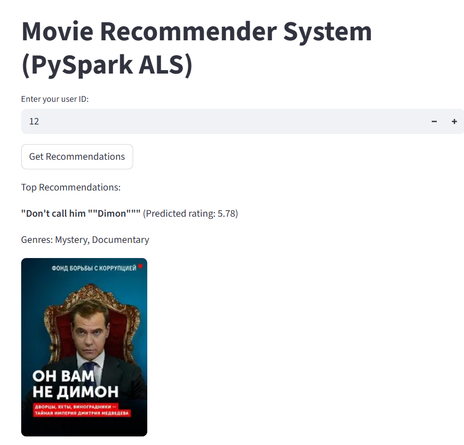

# Movie Recommender System with PySpark

## Overview
This project is an end-to-end movie recommendation system built for the Internet Movie Database (IMDB) scenario. It leverages the MovieLens dataset and PySpark's Alternating Least Squares (ALS) collaborative filtering algorithm to recommend movies to users based on their rating patterns. The solution is modular, containerized, and includes both a command-line and a Streamlit web interface for user interaction.

## Features
- **Collaborative Filtering**: Uses ALS matrix factorization for recommendations.
- **Data Pipeline**: Clean, preprocess, and split data for training and evaluation.
- **Model Evaluation**: Computes RMSE to assess model quality.
- **User Recommendations**: Get top movie recommendations for any user.
- **Streamlit Web App**: User-friendly web interface for recommendations.
- **Dockerized**: Easily build and run the app in a containerized environment.

## Data Sources
- [MovieLens Dataset (Kaggle)](https://www.kaggle.com/datasets/grouplens/movielens-20m-dataset)
- (Optional) [IMDB Public Dataset](https://datasets.imdbws.com/)

## Installation
1. **Clone the repository**
   ```bash
   git clone https://github.com/lkseier/Recommender-systems-with-Pyspark.git
   cd Recommender-systems-with-Pyspark
   ```
2. **Install dependencies**
   ```bash
   pip install -r requirements.txt
   ```
3. **(Optional) Prepare Data**
   - Place `ratings.csv` (and optionally `movies.csv`) in the `data/` directory.

## Usage
### 1. Run the Data Pipeline
Train the ALS model and save it for later use:
```bash
python run_pipeline.py
```

### 2. Get Recommendations for a User
```bash
python recommend.py <user_id>
```
Replace `<user_id>` with a valid user ID from your dataset.

### 3. Run the Streamlit App (Web UI)
```bash
streamlit run streamlit_app.py
```
Visit [http://localhost:8501](http://localhost:8501) in your browser.

### 4. Docker (Optional)
Build and run the Streamlit app in a container:
```bash
docker build -t recommender .
docker run -p 8501:8501 recommender
```

## Project Structure
```
├── data/                # Raw data files (ratings.csv, movies.csv, etc.)
├── src/                 # Source code modules (preprocessing, training, utils)
├── workflows/           # Notebooks and scripts
├── tests/               # Unit tests
├── run_pipeline.py      # Main pipeline script
├── recommend.py         # Command-line recommendation script
├── streamlit_app.py     # Streamlit web app
├── requirements.txt     # Python dependencies
├── Dockerfile           # Docker build file
└── README.md            # Project documentation
```

## Visuals
- 

## Contributors
- [Klebert Tchatchoua](https://github.com/lkseier)

## Timeline
- Project start: [2025-09-15]
- MVP delivery: [2025-09-19]

## License
This project is licensed under the MIT License.

---

**For questions or contributions, please open an issue or submit a pull request!**